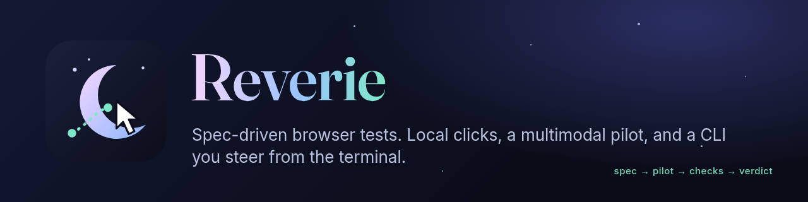
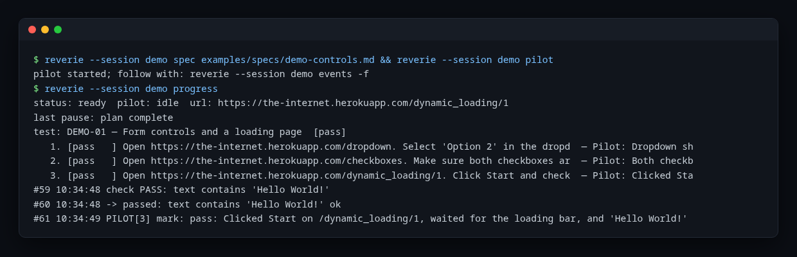
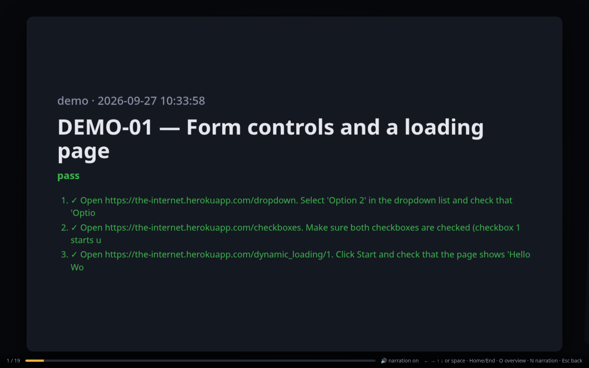
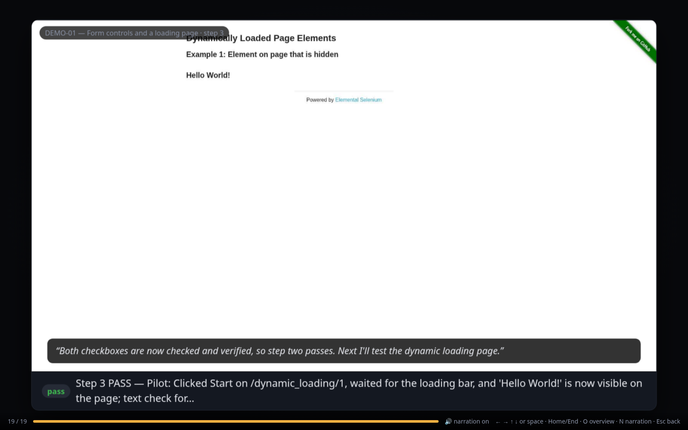

<p align="center"></p>

# Reverie

Reverie runs browser tests from Markdown specs. A local model makes each click, a multimodal pilot runs the spec step by step, and you control everything from a terminal CLI.

Reverie is the agent operation mode of [laya-ultrafast](https://github.com/Command-Perception/laya-ultrafast) as its own project. The browser agent, DOM snapshot, and executor come from [ipenywis/laya-ultrafast](https://github.com/ipenywis/laya-ultrafast) and [Browser Use's jev-ultrafast](https://github.com/browser-use/jev-ultrafast) (MIT).

<p align="center"></p>

## How it works

| Layer | Does |
|---|---|
| Laya (laya.cpp, local) | Makes each click and keystroke from the actions observed on the page. |
| Pilot (multimodal model, OpenRouter) | Runs the spec: sends intents, checks results, marks steps, records findings, reviews each step's screenshots, and speaks short progress updates. |
| Orchestrator (you or an agent) | Starts sessions and specs, signs in, handles checkpoints (database and mail proof), and reviews verdicts. |

Guards keep the run safe: commit buttons (Save, Delete, Confirm, and similar) need an explicit intent, the stack types only stated values, and loops and stalls end in a checkpoint instead of repetition. Tokens and codes are masked in trails and model context.

## Setup

```bash
uv sync
cp .env.example .env          # add OPENROUTER_API_KEY; point LAYA_BASE_URL at laya.cpp
scripts/agent-services.sh start   # optional: laya.cpp and local Kitten TTS
```

Run commands from the project you test. Reverie writes run evidence to `.reverie/runs/` in that project (see [Runs and history](#runs-and-history)).

Settings and API keys come from the environment first, then from these `.env` files. The first value found wins.

| File | Use |
|---|---|
| `$REVERIE_ENV_FILE` | An explicit file, for example in CI. |
| `<project root>/.env` | Settings for one project (the directory that holds `.reverie/`). |
| `./.env` | The working directory, when it differs from the project root. |
| `~/.config/reverie/.env` | Your API keys, shared by every project. Use mode 600. |

### Model endpoints

The pilot and the text helper call any OpenAI-compatible chat endpoint.

| Setting | Text helper | Pilot (falls back to the text helper's value) |
|---|---|---|
| Provider preset: `openrouter`, `opencode-go`, `deepseek` | `TEXT_MODEL_PROVIDER` | `LAYA_AGENT_PILOT_PROVIDER` |
| Base URL (wins over the preset) | `TEXT_MODEL_BASE_URL` | `LAYA_AGENT_PILOT_BASE_URL` |
| API key | `TEXT_MODEL_API_KEY` | `LAYA_AGENT_PILOT_API_KEY` |
| Model | `TEXT_MODEL` | `LAYA_AGENT_PILOT_MODEL` |

With `openrouter`, the key falls back to `OPENROUTER_API_KEY`. With `opencode-go`, reverie reads the key from `OPENCODE_GO_API_KEY` or from OpenCode's `~/.local/share/opencode/auth.json` (`OPENCODE_AUTH_FILE` points it at another file, such as Pi's `~/.pi/agent/auth.json`). It sends the `reverie/<version>` user agent and one `x-opencode-session` id per process, as OpenCode Go requires. Example: `LAYA_AGENT_PILOT_PROVIDER=opencode-go` and `LAYA_AGENT_PILOT_MODEL=glm-5.3-flash`.

### Decision engines

Under the pilot, a fast layer makes each click and keystroke, and Mercury (the text model) steps in when that layer is unsure.

| Engine | Where it runs | Choose it with |
|---|---|---|
| Laya (default) | Locally, through laya.cpp or MLX | nothing, or `--engine laya` |
| Jev | Hosted on OpenRouter's Decisions API (`typesafe/jev-1.13`; `REMOTE_DECISION_MODEL` overrides it) | `reverie start --engine jev`, or `LAYA_AGENT_ENGINE=jev` |

The session's engine drives `do`, `auto`, and the pilot. `suggest --engine jev`, `auto --engine jev`, and `step --engine jev` use Jev for one command without Mercury. Jev needs `OPENROUTER_API_KEY`. It picks the element; the text helper supplies any value to type before anything runs, so the stated-value guard applies to Jev as it does to Laya. A decision costs about $0.0001 and takes about 250 ms. `scripts/jev-smoke.sh` runs a live check (opt-in; `--e2e` also runs a WidgetLab spec headless with Jev).

## Use

`reverie` and `laya-agent` are the same command.

```bash
uv run reverie --session demo start --url https://example.com   # one browser daemon per session
uv run reverie --session demo spec path/to/test.md              # load a spec
uv run reverie --session demo note "Use order WO-21"             # fixture facts (no secrets)
uv run reverie --session demo pilot                              # run it in the background
uv run reverie --session demo progress                           # one-screen status
uv run reverie --session demo checkpoints                        # work the pilot needs from you
uv run reverie --session demo resolve <id> done --note "facts"   # then: pilot
uv run reverie ui                                                # dashboard at http://127.0.0.1:7788/
```

Other ways to drive a session:

- `do "<intent>"`: the stack carries out one intent.
- `suggest`, then `accept` or `reject --hint`: one step at a time.
- `observe`, `act e5 --text ...`, `check --text ...`: direct control.

Exit codes: 0 ok, 1 check failed, 2 refused, 3 error, 4 no session.

## Downloads

Files that the browser downloads go to a folder that Reverie controls. They never go to `~/Downloads`.

| Setting | Effect |
|---|---|
| `--download-dir PATH` on `reverie start` | Use this folder. It wins over the environment variable. |
| `REVERIE_DOWNLOAD_DIR=PATH` (environment or `./.env`) | Use this folder when the option is not set. |
| Neither | Use `downloads/` inside the run folder: `.reverie/runs/<session>-<stamp>/downloads/`. |

The folder is created on start. It works for headed and headless sessions, for isolated tabs, and for a persistent `--profile` (Reverie replaces the profile's saved download folder). `reverie status` prints `download_dir`, and `--json status` returns it, so a caller can find the files. Reverie keeps the folder with the other run artifacts and does not delete it on `stop`.

## Runs and history

Reverie keeps its state in `.reverie/` in the project where it runs. Like git with `.git`, it uses the nearest `.reverie/` in the current directory or a parent; with none, it uses the current directory.

```bash
uv run reverie init          # create .reverie/ with a README, a .gitignore, runs/, and specs/
```

| Path | Holds |
|---|---|
| `.reverie/runs/<session>-<stamp>/` | One run: `trail.jsonl` (every event, the source of truth), `run.json` (spec id, title, verdict, steps done), and `frames/` for replay. |
| `.reverie/specs/` | Stored specs. The README there describes the format. |
| `.reverie/cache/` | Disposable caches, such as narration audio. |
| `.reverie/playbook.json` | Lessons the pilot keeps per host. `LAYA_AGENT_PLAYBOOK` overrides the path. |

Git ignores `runs/` and `cache/`. `init` is safe to run again; it creates only what is missing.

Review history and the current run in the dashboard:

```bash
uv run reverie ui                        # current and past runs from .reverie/runs
uv run reverie ui --root path/to/runs    # runs from another directory
uv run reverie runs list                 # run ids for walkthrough and hide
uv run reverie runs import-legacy        # move old artifacts/agent-sessions runs into .reverie/runs
uv run reverie runs import-legacy --from ../old-tool/artifacts/agent-sessions --copy \
    --map-source /old/specs/=/new/.reverie/specs/   # import runs from another checkout
```

`import-legacy` writes a `run.json` summary for each imported run and can rewrite spec paths when the specs moved. The dashboard and `runs` also read the older `artifacts/agent-sessions/` directory while it exists, so earlier runs stay visible until you import them.

## Docker

A container image runs Reverie with headless or headed Chromium, GPU acceleration (Mesa and VA-API through `/dev/dri`; NVIDIA through the container toolkit), narration audio, and a non-root user that matches your host UID/GID. It supports `linux/amd64` and `linux/arm64`.

```bash
scripts/reverie-docker.sh build                       # builds reverie:local
cd path/to/your-project
path/to/reverie/scripts/reverie-docker.sh --session demo start --url http://localhost:8765/login
path/to/reverie/scripts/reverie-docker.sh --session demo pilot
path/to/reverie/scripts/reverie-docker.sh gpu-check   # prove GPU acceleration
```

The launcher mounts the project, `~/.config/reverie/.env` (read-only), a downloads volume (`REVERIE_DOWNLOAD_DIR=/downloads`), the display and audio sockets, and uses host networking so the container reaches local stacks. See [docs/docker.md](docs/docker.md).

## Screenshots

Reverie includes a demo spec ([`examples/specs/demo-controls.md`](examples/specs/demo-controls.md)) that runs against the public practice site the-internet.herokuapp.com. The images below come from one pass of that spec.

**Dashboard.** Suites, tests, and runs on the left, the frame for the selected event in the middle, and the event timeline on the right. Arrow keys step through the frames and play the recorded narration.

<p align="center"></p>

**Replay.** A slide for each unique frame, with step cards, verdicts, and the pilot's spoken updates.

<p align="center">
  
  
</p>

Try it:

```bash
uv run reverie --session demo start --url https://the-internet.herokuapp.com/
uv run reverie --session demo spec examples/specs/demo-controls.md
uv run reverie --session demo pilot
uv run reverie ui
```

## Specs

A spec is one Markdown file with front matter (`id`, `app`, `session`, `role`) and the sections Goal, Fixtures, Steps, Walkthrough, Evidence, Guidance, and Cleanup. Steps become the plan. A step that starts with `[admin]` becomes a checkpoint for the orchestrator. `walkthrough <run> --write <spec>` turns a passing run into click-by-click steps.

Two local demo apps come with specs to practice on: [FieldOps](examples/fieldops/README.md) (a field-service app; FS-01..FS-05) and [WidgetLab](examples/widgetlab/README.md) (a wizard, browser dialogs, late content, a download, tabs, and type-ahead; WL-01..WL-05).

## UI concepts

`ui/` holds a Storybook with design concepts for the dashboard: mission control, a checkpoint inbox, a step-centric run view, frame compare, a suite matrix, and findings triage. Run `cd ui && npm install && npm run storybook`.

## Tests

```bash
uv run pytest
```

## Contributing

Work goes through branches and pull requests. See [CONTRIBUTING.md](CONTRIBUTING.md) for the workflow and [AGENTS.md](AGENTS.md) for coding agents. Changes are listed in [CHANGELOG.md](CHANGELOG.md).

## License

MIT. See [LICENSE](LICENSE).
