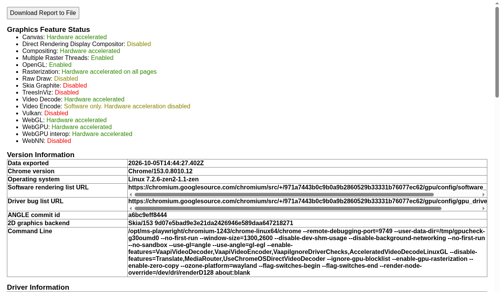

# Run Reverie in a container

The container image holds Reverie, uv, Python 3.12, Playwright's Chromium, the Mesa GPU stack with VA-API, and
the PulseAudio client tools. It runs headless or headed, with or without audio, and uses the host GPU.

Reverie does not depend on Playwright. Reverie starts Chromium itself and talks to it over CDP. The image uses
Playwright only to install a Chromium build for both amd64 and arm64. `reverie-chromium` is a wrapper that adds the
container flags. The image sets `REVERIE_BROWSER` to it.

## Quick start

```bash
scripts/reverie-docker.sh build                 # one platform, loads reverie:local
scripts/reverie-docker.sh doctor                # user, display, audio, GPU, VA-API
scripts/reverie-docker.sh gpu-check             # opens chrome://gpu, saves gpu.txt and gpu.png in the downloads volume
cd ~/my-project
~/path/to/reverie/scripts/reverie-docker.sh --session demo start --url http://localhost:8765/login
~/path/to/reverie/scripts/reverie-docker.sh --session demo spec path/to/test.md
~/path/to/reverie/scripts/reverie-docker.sh --session demo pilot
~/path/to/reverie/scripts/reverie-docker.sh down
```

Any argument that is not a launcher command goes to `reverie`. `reverie start` leaves a daemon running, so the
launcher keeps one container per project (`reverie-<project dir>`) and runs each command with `docker exec`. The first
command starts the container. `down` removes it.

## What the launcher mounts

| Item | Container path | Notes |
|---|---|---|
| Project directory | same path as on the host | Reverie finds `.reverie/` and your specs at the same paths. |
| Downloads | `/downloads` | Host `<project>/.reverie/downloads`. `REVERIE_DOWNLOAD_DIR=/downloads` is set for the download-folder option. |
| Runs and artifacts | `<project>/.reverie/runs` | Part of the project mount. `REVERIE_RUNS_DIR` moves it. |
| `~/.config/reverie/.env` | `/etc/reverie/.env` (read-only) | `REVERIE_ENV_FILE` points Reverie at it, so it wins over the project's `.env` files. |
| `/dev/dri` | `/dev/dri` | The render and video groups of the host nodes are added with `--group-add`. |
| Wayland or X11 socket | `/runtime/<wayland-0>` or `/tmp/.X11-unix` | Chosen automatically; `REVERIE_DISPLAY=headless` forces headless. |
| PulseAudio or PipeWire socket | `/runtime/pulse/native` | PipeWire provides the same socket. `REVERIE_AUDIO=off` removes it. |

The container runs as `--user "$(id -u):$(id -g)"`, so files in the mounted volumes belong to you. The image also has
a `reverie` user with UID/GID 1000 (build args `REVERIE_UID` and `REVERIE_GID`) for use without the launcher.

## Settings

| Variable | Values | Default |
|---|---|---|
| `REVERIE_IMAGE` | image tag | `reverie:local` |
| `REVERIE_DISPLAY` | `auto`, `wayland`, `x11`, `headless` | `auto` (Wayland, then X11, then headless) |
| `REVERIE_AUDIO` | `auto`, `on`, `off` | `auto` (on when the socket exists) |
| `REVERIE_GPU` | `auto`, `dri`, `nvidia`, `off` | `auto` (`dri` when a render node exists) |
| `REVERIE_GPU_BACKEND` | `egl`, `vulkan` | `egl` |
| `REVERIE_DOCKER_NETWORK` | `host`, `bridge`, a network name | `host` |
| `REVERIE_ENV_FILE`, `REVERIE_DOCKER_DOWNLOADS`, `REVERIE_RUNS_DIR`, `REVERIE_PROJECT`, `REVERIE_SHM` | paths and size | see the script header |
| `REVERIE_CHROMIUM_FLAGS` | extra Chromium flags | none |
| `REVERIE_CHROMIUM_SANDBOX` | `1` keeps the Chromium sandbox | `0` |

With `REVERIE_DISPLAY=headless` (or no display socket), the launcher adds `--headless` to `reverie start`.
With `REVERIE_AUDIO=off`, the entrypoint sets `SPEECH_PROVIDER=off`.

Host networking (the default) lets the container reach apps on `localhost` (for example FieldOps on `:8765`), a host
Laya or Kitten server (`127.0.0.1:8080`, `127.0.0.1:8890`), and remote QA sites. It also makes the dashboard
(`reverie ui`, port 7788) reachable on the host. With `bridge`, use `host.docker.internal` or published ports.

## Narration

Narration plays through `paplay`, or through `mpv` for the `fish` voice. The image includes both players.
With `SPEECH_PROVIDER=fish` and `FISH_AUDIO_API_TOKEN` and `FISH_AUDIO_VOICE_ID` in the env file, the voice
resolves to `fish`. A TTS server over HTTP (Kitten or Kokoro on the host) also works: use `--voice kitten`
or `SPEECH_PROVIDER=kitten`. The offline `espeak` voices are not in the image.

## GPU

AMD and Intel use Mesa through `/dev/dri`. The wrapper sets, for headless and headed runs:

```
--use-gl=angle --use-angle=gl-egl --ignore-gpu-blocklist --enable-gpu-rasterization --enable-zero-copy
--enable-features=VaapiVideoDecoder,VaapiVideoEncoder,VaapiIgnoreDriverChecks,AcceleratedVideoDecodeLinuxGL
--disable-features=Translate,MediaRouter,UseChromeOSDirectVideoDecoder
--ozone-platform=wayland|x11      (headed only)
```

Without `--use-angle=gl-egl`, headless Chromium falls back to SwiftShader (software) even with `/dev/dri` present.
`REVERIE_GPU_BACKEND=vulkan` uses ANGLE on Vulkan (RADV or ANV) and was also hardware accelerated in testing.
`REVERIE_GPU=off` forces software rendering.

Check VA-API and the browser:

```bash
scripts/reverie-docker.sh shell      # then: vainfo (set LIBVA_DRIVER_NAME=radeonsi or iHD if autodetect fails)
scripts/reverie-docker.sh gpu-check  # exit code 1 when Compositing, Rasterization, WebGL, or Canvas is software
```

### NVIDIA (documented, not tested)

Install the NVIDIA Container Toolkit on the host and run `sudo nvidia-ctk runtime configure --runtime=docker`.
Then start with the toolkit instead of `/dev/dri`:

```bash
REVERIE_GPU=nvidia scripts/reverie-docker.sh up      # adds --gpus all and NVIDIA_DRIVER_CAPABILITIES=all
# compose: docker compose -f docker/compose.yaml -f docker/compose.nvidia.yaml up -d
```

The toolkit injects the driver, EGL, and NVDEC libraries. The wrapper uses the same ANGLE EGL flags.
Chromium on Linux does not decode with NVDEC through VA-API unless `nvidia-vaapi-driver` is present; WebGL and
compositing work without it. Run `gpu-check` to see what the driver gives you.

## Build

```bash
scripts/reverie-docker.sh build                       # host platform, loaded into Docker
scripts/reverie-docker.sh build --multi --push        # linux/amd64 + linux/arm64; set REVERIE_IMAGE to a registry tag
scripts/reverie-docker.sh build --multi --output type=oci,dest=reverie.tar
```

- Base: `python:3.12-slim-trixie` (Mesa 25.0, libva 2.22). `TARGETARCH` selects packages: the Intel VA-API drivers
  (`intel-media-va-driver`, `i965-va-driver`) are installed on amd64 only. Mesa's VA drivers ship on both.
- Layer order: uv binary, system packages, Playwright and Chromium (rebuilds only when `PLAYWRIGHT_VERSION` changes),
  then `uv sync --no-install-project` (rebuilds only when `uv.lock` changes), then the `reverie` source.
- BuildKit cache mounts hold the apt and uv caches. `UV_COMPILE_BYTECODE=1` shortens startup.
- amd64 uses the generic x86-64 wheels. No CPU-specific (for example `x86-64-v3`) builds are made, because the
  Python dependencies and Chromium are prebuilt.
- Compose files are in `docker/` (`compose.yaml` plus `compose.wayland.yaml`, `compose.x11.yaml`, `compose.audio.yaml`,
  `compose.nvidia.yaml`).

## Limits

- `--no-sandbox` is on by default; the container is the sandbox. Set `REVERIE_CHROMIUM_SANDBOX=1` and add
  `--cap-add SYS_ADMIN` (or a seccomp profile that allows user namespaces) to keep Chromium's own sandbox.
- The image is large (about 1.35 GB on disk) because it holds Chromium, Mesa, and Vulkan drivers.
- Video encode stays software-only in Chromium on Linux, even with VA-API encode in the driver.
- A VA-API driver for the host GPU must exist in the image. Mesa covers AMD (radeonsi), Nouveau, and most Arm GPUs.
- The `linux/arm64` image builds from the same Dockerfile. It was not built or run on the author's x86-64 host.
- X11 passthrough is provided but only Wayland was run during testing. For X11, allow the user with
  `xhost +SI:localuser:$(id -un)` or mount an Xauthority file (the launcher mounts `$XAUTHORITY` when set).

## Verified on one host

Linux x86-64, an AMD integrated GPU (`radeonsi`), Mesa 25.0.7 in the container, Chromium 153, Wayland, PipeWire.
Reverie 0.1.0.

| Check | Result |
|---|---|
| `vainfo` in container | VA-API 1.22, radeonsi, H.264, HEVC, VC-1, MPEG-2, JPEG decode; H.264/HEVC encode |
| `chrome://gpu`, headless | Canvas, Compositing, Rasterization, Video Decode, WebGL, WebGPU: hardware accelerated; renderer `ANGLE (AMD, ... radeonsi ..., OpenGL ES 3.2 Mesa 25.0.7)` |
| `chrome://gpu`, headed on Wayland | same |
| Default flags only (no ANGLE EGL) | Software (SwiftShader) |
| Reverie session, headless, local page | `start`, `observe`, `act`, `check`, `screenshot`, `stop` pass; runs written as the host user |
| Reverie session, headed, Wayland | window opens, `act` and `check` pass |
| Audio | `paplay` plays through the PipeWire socket; Kitten voice resolved with the `paplay` player |

Screenshot of the headed `chrome://gpu` report: [docker-chromium-gpu.png](images/docker-chromium-gpu.png).


