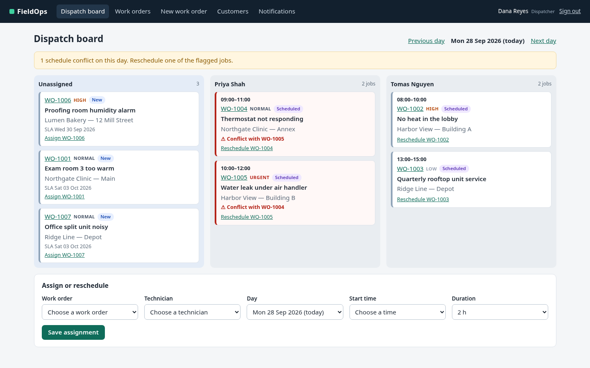

# FieldOps: a demo app and suite for Reverie

FieldOps is a small field-service management app. Dispatchers create work orders and put them on technicians'
days, technicians do the work on site, and managers invoice the finished jobs. It exists so you can watch Reverie
test a realistic app end to end: sign-in, forms, a dispatch board, a state machine, validation, and one real bug.

The app is local and self-contained: Python standard library only (`http.server`, `sqlite3`), server-rendered HTML,
plain forms with real labels and stable `id`/`name` attributes, no JavaScript, and no external services.

<p align="center"></p>

## Run and reset

```bash
cd examples/fieldops
./run.sh                 # http://127.0.0.1:8765/login  (PORT=9000 ./run.sh for another port)
./reset.sh               # delete the database and write the seed data again
./query.sh "select number, status from work_orders"   # read-only SQL, for [admin] proof
```

`run.sh` uses `uv run --script` when uv is installed, else `python3` (3.11 or later). The database is
`app/data/fieldops.db`; the first start seeds it. Seeded dates are relative to today, so reset on the day you
test.

## Demo users

These accounts and the password are **synthetic demo values** for a local demo. They protect nothing.

| Username | Name | Role | Lands on |
|---|---|---|---|
| `dana.dispatch` | Dana Reyes | dispatcher | Dispatch board |
| `tom.tech` | Tomas Nguyen | technician | My jobs |
| `priya.tech` | Priya Shah | technician | My jobs |
| `mia.manager` | Mia Okafor | manager | Work orders |

Password for every account: `fieldops-demo`.

## What is in the app

| Page | Who | What it does |
|---|---|---|
| Sign in (`/login`) | everyone | Username and password; a wrong pair shows an inline error |
| Dispatch board (`/dispatch`) | dispatcher, manager | Unassigned queue and one column per technician for a day; previous and next day; overlapping jobs are flagged as conflicts; an "Assign or reschedule" form (work order, technician, day, start time, duration) |
| Work orders (`/work-orders`) | dispatcher, manager | List with status filters; SLA due dates, overdue ones in red |
| New work order (`/work-orders/new`) | dispatcher, manager | Customer, site, title, priority, optional SLA due date (default by priority), description; inline errors with an error summary |
| Work order detail (`/work-orders/WO-…`) | dispatcher, manager | Details, parts used, completion, activity log; cancel with a reason; "Create invoice" for a manager when the job is Completed |
| My jobs and job view (`/jobs`, `/jobs/WO-…`) | technician | Start travel, Arrive on site, checklist, parts with quantities, notes, customer sign-off (name and a confirmation box), Complete job |
| Invoices (`/invoices`, `/invoices/INV-…`) | manager | Labor and part lines, subtotals, total; record a payment reference to mark it paid |
| Customers (`/customers`) | dispatcher, manager | Customers and their sites; add a customer or a site |
| Notifications (`/notifications`) | everyone | The emails FieldOps would send (visit scheduled, technician on the way, job completed, invoice, payment, cancellation) |

Work order status: New → Scheduled → En route → In progress → Completed → Invoiced, or Cancelled from New,
Scheduled, or En route. Every change writes to the work order's activity log.

## The intentional bug

FieldOps ships with **one deliberate defect** so the suite has a real finding to report:

> The invoice parts subtotal ignores part quantity. It adds each part's unit price once, so a line with a
> quantity above 1 is undercharged.

The invoice lines show the right amounts (3 × $12.50 = $37.50), but the subtotal and total do not. For the seeded
job WO-1008 (2 h labor at $95, 3 × air filter at $12.50, 1 × capacitor at $28) the invoice shows a parts
subtotal of **$40.50** and a total of **$230.50**; the correct values are **$65.50** and **$255.50**. The cause is
one line in `app/store.py` (`create_invoice`). Spec FS-04 exposes it. Do not fix it if you want the demo to show
a failing test.

## Run the suite with Reverie

The specs are in [`specs/`](specs/); [`specs/README.md`](specs/README.md) lists them and the expected results.
Run Reverie from this folder, so run history goes to `examples/fieldops/.reverie/`. The pilot needs its model key
(`OPENROUTER_API_KEY`) in the environment or in a `.env` file in this folder.

```bash
cd examples/fieldops
./reset.sh
./run.sh &
reverie init                                    # creates .reverie/ for runs and stored specs

# Start a browser session for the spec's role.
reverie --session dispatcher start --url http://127.0.0.1:8765/login

# The orchestrator signs in. The password field is hidden from the pilot; `secret` types it from a variable.
export FIELDOPS_PASSWORD='fieldops-demo'        # synthetic demo value
reverie --session dispatcher observe            # note the refs of Username and Sign in
reverie --session dispatcher fill <username-ref> --text dana.dispatch
reverie --session dispatcher secret --env FIELDOPS_PASSWORD
reverie --session dispatcher click <sign-in-ref>

# Load the spec and let the pilot run it.
reverie --session dispatcher spec specs/fs-01-create-and-dispatch.md
reverie --session dispatcher pilot
reverie --session dispatcher progress           # poll until the run is done
reverie --session dispatcher checkpoints        # [admin] steps wait here
./query.sh "select number, status, priority, technician_id, start_min from work_orders order by id desc limit 1"
reverie --session dispatcher resolve <id> done --note "WO-1011 | Scheduled | Urgent | 2 | 930"
reverie --session dispatcher pilot              # continue after the checkpoint

reverie ui                                      # review the run at http://127.0.0.1:7788/
reverie --session dispatcher stop
```

For FS-02 use a `technician` session signed in as `tom.tech`; for FS-04 a `manager` session signed in as
`mia.manager`. Reset the data before each spec. After a run passes, write its click-by-click walkthrough into the
spec with `reverie runs list` and `reverie walkthrough <run-id> --write specs/<spec>.md`.

The recipes in [`fixtures/`](fixtures/) cover the seed data, the sign-in, and the database proof.

## Files

```
examples/fieldops/
  run.sh  reset.sh  query.sh      start, reset, read-only SQL
  app/fieldops.py                 HTTP server, routes, CLI (serve, reset, query)
  app/store.py                    SQLite schema, seed data, work order state machine
  app/views.py                    HTML pages
  app/static/app.css              styles
  specs/                          FS-01 to FS-05 and the suite README
  fixtures/                       seed data, sign-in, and database proof recipes
  docs/                           screenshots
```
