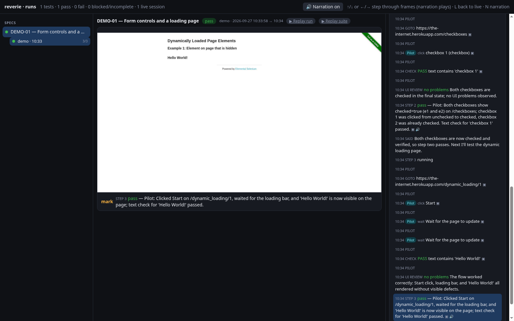

Every session writes its evidence to disk. You review it later with the dashboard, a replay deck, or a click-by-click walkthrough.

## The `.reverie/` folder

Reverie keeps its state in `.reverie/` in the project where it runs. Like git with `.git`, it uses the nearest `.reverie/` in the current directory or any parent. If there is none, it uses the current directory.

```bash
reverie init
```

`init` creates `.reverie/` with a README, a `.gitignore`, `runs/`, and `specs/`. Running it again creates only what is missing.

| Path | Holds |
|---|---|
| `.reverie/runs/<session>-<stamp>/` | One run. See below. |
| `.reverie/specs/` | Stored specs. Its README shows the format. |
| `.reverie/cache/` | Disposable caches, such as narration audio for the dashboard. |
| `.reverie/playbook.json` | Lessons the pilot keeps for each host. Set `LAYA_AGENT_PLAYBOOK` to use another path. |
| `.reverie/runs/hidden-runs.json` | Ids of runs you hid. |

Git ignores `runs/` and `cache/`. Commit `playbook.json` if its lessons help other people.

Each run folder holds:

- `trail.jsonl`: every event of the session. This is the source of truth.
- `run.json`: a short summary (spec id, title, verdict, steps done) for fast listing.
- `frames/`: screenshots that make replay possible.
- `downloads/`: files the session's browser downloaded. See [Downloads](#downloads).

Reading history never creates `.reverie/`. The dashboard and `runs` also read the older `artifacts/agent-sessions/` folder while it exists.

## Manage runs

```bash
reverie runs list
```

Each line shows a run id, its result, and its title. Use the id with `hide` and `walkthrough`.

| Command | Does |
|---|---|
| `runs list` | Lists runs: id, result, title. |
| `runs hide RUN_ID ...` | Hides runs from the dashboard and from `list`. Trails and frames stay on disk. |
| `runs prune` | Hides finished runs that are incomplete, failed, or blocked. Live runs always stay. Trails stay on disk. |
| `runs import-legacy` | Moves runs from `artifacts/agent-sessions` into `.reverie/runs`, merges the hidden list, and writes a `run.json` for runs that lack one. With `--from`, imports from another directory. |

All `runs` actions accept `--root DIR` (repeatable) to read runs from another directory.

### Import runs from another checkout

`import-legacy` can also bring in runs from a different checkout or an older runs directory.

```bash
reverie runs import-legacy --from /path/to/other-checkout/artifacts/agent-sessions --copy \
    --map-source /path/to/other-checkout/specs/=/path/to/project/.reverie/specs/
```

| Option | Does |
|---|---|
| `--from DIR` | Imports run folders from this directory instead of `artifacts/agent-sessions`. |
| `--copy` | Copies the runs and leaves the originals in place. Without it, the runs are moved. |
| `--map-source OLD=NEW` | Rewrites spec paths that start with `OLD` to start with `NEW` in each imported trail and `run.json`. Use it when the specs moved. Repeatable. |

Only folders that hold a `trail.jsonl` are imported, and a run whose folder already exists in `.reverie/runs` is skipped. Reverie writes a `run.json` summary for every imported run that has none, so the run lists quickly. The command prints how many runs it moved or copied, then each folder.

## Downloads

Files that the session's browser downloads go to a folder Reverie controls. They never go to `~/Downloads`.

| Setting | Effect |
|---|---|
| `reverie start --download-dir PATH` | Use this folder. It wins over the environment variable. |
| `REVERIE_DOWNLOAD_DIR=PATH` | Use this folder when the option is not set. |
| Neither | Use `.reverie/runs/<session>-<stamp>/downloads/`. |

Reverie creates the folder on start. It works for headed and headless sessions, and for a persistent `--profile`, where it replaces the profile's saved download folder. `reverie status` prints the path as `download_dir`. Reverie keeps the folder with the other run artifacts and does not delete it on `stop`.

## The dashboard

```bash
reverie ui
```

The command starts the dashboard if it is not running and opens it in your default browser. It prints the address. Add `--print-only` to skip opening the browser. You can also open it from `start` with `--ui`.

```bash
reverie ui --root /path/to/runs
```

`--root` reads runs from another directory instead of `.reverie/runs`. You can repeat it.

The dashboard listens on `127.0.0.1` only. The default port is 7788. Set `LAYA_AGENT_UI_PORT` to change it. If the port is taken, the dashboard picks any free port and `reverie ui` prints the address. One dashboard serves every session. If it is running for a different project, `reverie ui` restarts it on the current project's runs.



The page has three areas. Suites, tests, and runs are on the left. The browser frame for the selected event is in the middle, with a caption of what the agent did. The event timeline and the test plan are on the right. A live session shows its current frame and any question that waits for you, with buttons to answer it.

### Keyboard keys

| Key | Does |
|---|---|
| Down, Right, or `j` | Next frame. |
| Up, Left, or `k` | Previous frame. |
| `L` | Back to live. |
| `N` | Turn narration playback on or off. |

When you land on a frame, the narration recorded for it plays. Your narration choice is remembered in your browser. See [Narration](/reverie/guides/narration/).

## Replay

Each run has a **Replay run** link in the dashboard, and each suite has a **Replay suite** link. They open a slide deck at `/replay` on the dashboard address. There is one slide for each unique frame. Title slides show each test's verdict, step cards show the step, and verdict slides show the pilot's note.


| Key | Does |
|---|---|
| Right, Down, Page Down, Space, `j`, or `l` | Next slide. |
| Left, Up, Page Up, `k`, or `h` | Previous slide. |
| Home or End | First or last slide. |
| `O` | Toggle the overview of all slides. |
| `N` | Narration on or off. |
| Esc | Go back. |

A run recorded before frame saving existed has no frames. Rerun it to get a replay.

## Watch a live session

```bash
reverie --session demo watch
```

This opens the watch page for one running session. It shows the live frame with a caption, the test plan, checks, the step list, and the lines spoken so far. Checkpoints for you appear in a panel, and questions show reply buttons. Use `--print-only` to print the address without opening a browser.

The watch page is served by the session itself. This makes it the way to follow a session started with `--headless`, which opens no window and streams frames instead.

## Recap, history, and walkthrough

`recap` speaks a short summary of the steps since the last recap. Add `--note` to give the summary some context.

```bash
reverie --session demo recap
```

`history` lists every action of the current session: step number, who did it, the kind, the label, and any text typed.

```bash
reverie --session demo history
```

`walkthrough` turns a recorded run into click-by-click Markdown. For each plan step it lists the actions that worked and the proof from passing checks.

```bash
reverie walkthrough RUN_ID
reverie walkthrough RUN_ID --write path/to/spec.md
```

With `--write`, Reverie replaces the `## Walkthrough` section of the spec, or adds one before `## Evidence`. The pilot reads that section as a note on later runs. See [Writing specs](/reverie/guides/writing-specs/).
